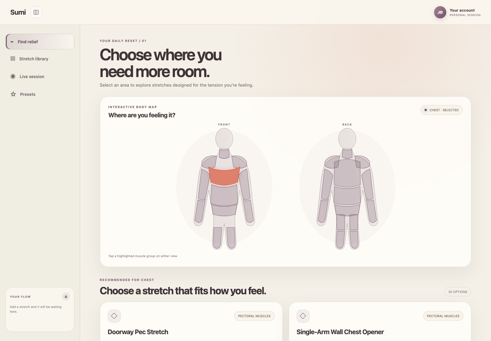
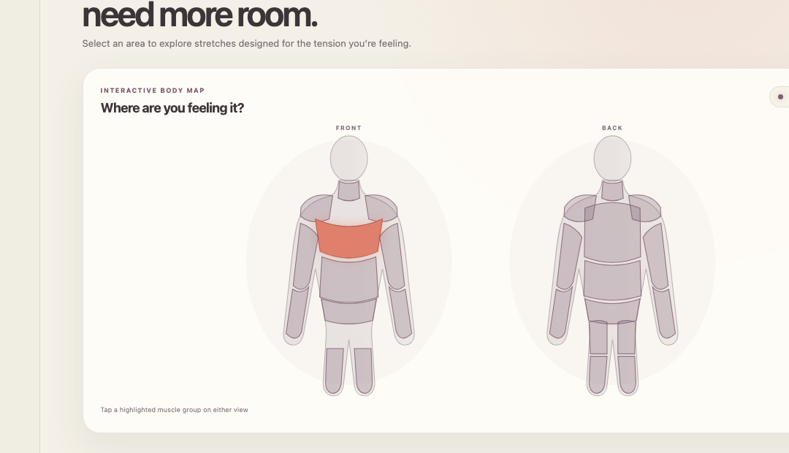

# Sumi

> A smarter way to find, understand, and practice mobility exercises.

Sumi is a browser-based mobility companion that helps people discover stretches for the areas where they feel tight, assemble personalized flows, and receive real-time camera guidance while they move.

Built for TigerHacks 2026, Sumi combines an interactive body map, a curated library of 220 stretches, animated demonstrations, and on-device pose tracking in one approachable experience.



## Why we built it

We were inspired by early AI cooking assistants that could turn the ingredients someone already had into a useful recipe. Sumi applies that same idea to mobility: tell the app what part of your body needs attention, and it helps you build a practical stretching routine from the movements available in its library.

Our goal was to make mobility guidance easier to explore without requiring users to know anatomical terminology or the exact name of a stretch.

## Features

- **Interactive body map** — select one of 11 muscle groups from front and back views.
- **220-stretch library** — browse and search by body area, muscle, exercise, difficulty, or equipment.
- **Personalized stretch flows** — add movements to a playlist, reorder them, and save useful presets.
- **Animated demonstrations** — preview the intended movement before starting a session.
- **Live pose tracking** — use MediaPipe Pose Landmarker to detect 33 body landmarks through the browser camera.
- **Form heuristics** — compare visible joint angles against stretch-specific rules and surface simple adjustments.
- **Distance-friendly feedback** — the camera border changes from red to yellow to green as pose visibility and form improve.
- **Private by design** — camera and pose processing stay on the user's device.
- **Session controls** — follow a timer and progress bar, pause a stretch, and move through a complete flow.
- **Collapsible workspace** — create more room for the camera and session content when needed.



## How it works

1. Select a highlighted body area on the interactive map or search the stretch library.
2. Review each stretch's purpose, difficulty, equipment, instructions, safety notes, and animated form preview.
3. Add one or more stretches to a flow, or start from a preset.
4. Begin a live session and optionally enable the camera.
5. MediaPipe finds visible pose landmarks locally in the browser.
6. Sumi evaluates supported joint-angle relationships and displays clear visual feedback.

The form checks are intentionally lightweight demonstrations. They cannot measure pain, pressure, balance, or contact with a wall or prop, and they are not medical advice.

## Technical approach

Sumi uses React components for the body map, library, flow planner, presets, animated modal, and live session. A structured local dataset supplies the 220 stretches and their metadata. The live session loads Google's MediaPipe Pose Landmarker, draws detected landmarks on an HTML canvas, and applies stretch-specific rules to three-point joint angles represented as 2D vectors.

The camera glow and status panel translate those results into feedback that remains visible even when the user steps away from the screen.

### Built with

- React and JSX
- Vite
- JavaScript
- HTML and CSS
- Google MediaPipe Tasks Vision / Pose Landmarker
- Git and GitHub
- Codex and Gemini as development tools

## Run locally

### Requirements

- Node.js 18 or newer
- npm
- A modern browser
- A camera and camera permission for live pose tracking

### Setup

```bash
git clone https://github.com/nicowol/TigerHack2026.git
cd TigerHack2026
npm install
npm run dev
```

Open the local URL printed by Vite. Camera access requires `localhost` or a secure HTTPS connection.

### Production build

```bash
npm run build
npm run preview
```

### Other commands

```bash
npm run format
npm run format:check
```
